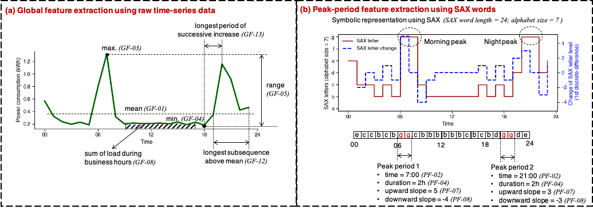

# Interpretable Feature Extraction of Electricity Loads (IFEEL)

* A python package for **Interpretable Feature Extraction of Electricity Loads** (IFEEL).
* IFEEL has a similar pronunciation to the Eiffel Tower 🗼 so you will find two "Eiffel" electricity towers in the IFEEL logo.
* Description of IFEEL can be found on **GitHub** [🔗](https://github.com/chacehoo/IFEEL) (*Recommended, no image loading issue*) or **PyPI** [ 🔗](https://pypi.org/project/ifeel/)

## 📌 Illustration:

**Note**: If the picture fails to load, please click [here](https://github.com/chacehoo/IFEEL/blob/main/Image/FEEL.png).

## ⚙️ Installation:

You can use `pip`  to easily install IFEEL with:

`pip install ifeel`

More info about `pip` can be found [here](https://pip.pypa.io/en/stable/) .

## 🤖 Developer info:
* **Package title**: Interpretable Feature Extraction of Electricity Load (IFEEL)

* **Authors**: [Maomao Hu](https://maomaohu.net/), [Dongjiao Ge](https://eng.ox.ac.uk/people/dongjiao-ge/), [David Wallom](https://eng.ox.ac.uk/people/david-wallom/)

* **Organization**: [Oxford e-Research Center](https://www.oerc.ox.ac.uk/), Department of Engineering Science, University of Oxford

* **Contact info**: maomao.hu@eng.ox.ac.uk

* **Development time**: Oct 2020

* **Acknowledgement**: This work was financially supported by the UK Engineering and Physical Sciences Research Council (EPSRC) under grant (EP/S030131/1) of [AMIDINE](https://www.amidine.net/). We also would like to thank the help from [Bruce Stephen](https://www.strath.ac.uk/staff/stephenbrucedr/), [Jethro Browell](http://www.jethrobrowell.com/), [Rory Telford](https://www.strath.ac.uk/staff/telfordrorymr/), [Stuart Galloway](https://www.strath.ac.uk/staff/gallowaystuartdr/), and [Ciaran Gilbert](https://pureportal.strath.ac.uk/en/persons/ciaran-gilbert) from the University of Strathclyde.

## 💬 About IFEEL:
(1) This Python package (i.e., IFEEL) aims to help energy data analysts to readily extract interpretable features of daily electricity profiles from a physical perspective. The extracted features can be applied for further feature-based machine learning purposes, including feature-based PCA, clustering, classification, and regression.

(2) Two PY files (.py) are included in the IFEEL package, including *ifeel_transformation.py* and *ifeel_extraction.py*.

(3) Two types of features, including 13 global features (GFs) and 8 peak-period features (PFs), can be extracted by using this package. Detailed description of all features can be found in Ref [1] or the Demo file in the installed IFEEL package.

(4) GFs are extracted based on raw time-series data, while PFs are extracted based on symbolic representation of time series data. GFs and PFs can be obtained by using `IFEEL.ifeel_extraction.feature_global` and `IFEEL.ifeel_extraction.feature_peak_period`, respectively. 

(5) For fast peak-period feature extraction, Symbolic Aggregate approXimation (SAX) representation is first used to transform the time-series numerical patterns into alphabetical words. The feature transformation process is performed by calling `IFEEL.ifeel_transformation.feature_transformation`. More details about SAX approach can be found in Ref [2] and Ref [3].

## 🔈 Notes:
(1) To successfully run the IFEEL, the following Python data analysis libraries need to be installed in advance: [Numpy](https://numpy.org/), [Scipy](https://www.scipy.org/), and [Pandas](https://pandas.pydata.org/).

(2) A **Demo** can be found in the installed IFEEL package or [here](https://github.com/chacehoo/IFEEL/blob/main/IFEEL/Demo.py). Three datasets at different time intervals can be downloaded [here](https://github.com/chacehoo/IFEEL/tree/main/Test_Data), and tested in the Demo.

(3) The **Demo** has been tested on Python 3.7.7.

## 📚 References
[1] Hu M, Ge D, Telford R, Stephen B, Wallom D. Classification and characterization of intra-day load curves of PV and non-PV households using interpretable feature extraction and feature-based clustering. *Sustainable Cities and Society*. 2021;75:103380.

[2] Lin J, Keogh E, Wei L, Lonardi S. Experiencing SAX: a novel symbolic representation of time series. *Data Mining and Knowledge Discovery*. 2007;15:107-44.

[3] Keogh E, Lin J, Fu A. HOT SAX: efficiently finding the most unusual time series subsequence.  *5TH IEEE International Conference on Data Mining (ICDM'05)*. 2005. p8.

